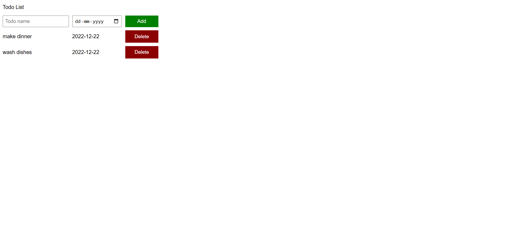

# 📋 To-Do List Web App

A simple, responsive **To-Do List** web application built using **HTML, CSS, and JavaScript**.  
This app allows users to add tasks with a specific date and delete them easily in a clean and intuitive interface.

---

## 🚀 Features
- ✏️ Add new tasks with a chosen date.  
- 🗑 Delete tasks you no longer need.  
- 📱 Responsive and minimal design.  

---

## 🛠 Technologies Used
- **HTML5** – Structure of the app.  
- **CSS3** – Styling and layout.  
- **JavaScript (ES6)** – App functionality and logic.  

---

## 📂 Project Table  

| Title      | Code | Live Demo |
|------------|------|-----------|
| To-Do List | [Code](https://github.com/rohini19-coder/To-do-list) | [Demo](https://rohini19-coder.github.io/To-do-list-project/) |

---

## 📸 Screenshot  

### 🏠 App Interface  
  

---
